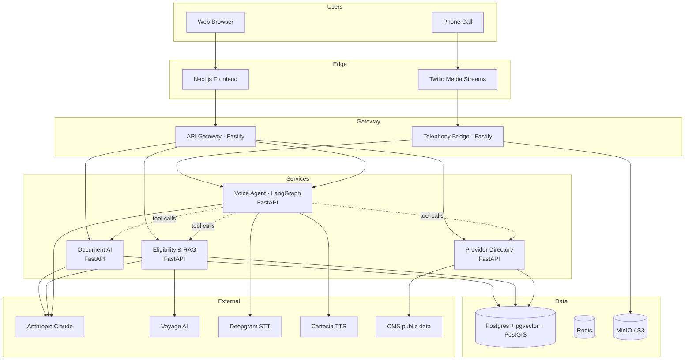

# ClaimVoice Architecture

## What is this

ClaimVoice is a voice agent for US health insurance members. Photograph your
card, talk to an AI that knows your plan, your deductible, your in-network
providers. Coverage answers come from structured data, not LLM guesses.

## High-level diagram

## Services

| Service | Port | What it does |
| --- | --- | --- |
| api-gateway | 8080 | Auth, rate limit, audit log, routes |
| document-ai | 8001 | Card OCR (LayoutLMv3), SBC parsing |
| eligibility | 8002 | X12 stub, plan graph, SBC RAG, formulary, fact-check |
| providers | 8003 | NPI + PostGIS geo + Care Compare + MRF |
| voice-agent | 8004 | LangGraph state machine, Claude tool calls, hallucination guard |
| telephony | 8005 | Twilio bridge, audio codec, recording |
| Next.js web | 3000 | Frontend |

## Data layer

- **Postgres 16** with `pgvector` (RAG embeddings) and `PostGIS` (provider geo).
- **Redis 7** for sessions and cache.
- **MinIO** for card images, recordings, DVC remote.

## Observability

- **Langfuse** for LLM-specific tracing (cost, latency, token usage).
- **Prometheus + Grafana** for service metrics.
- **OpenTelemetry** SDK in every service via `shared-observability`.
- **MLflow** for training runs.
- **Inspect AI** for the eval harness, run nightly.

## Cross-cutting

- **shared-logging** — JSON log schema (loguru + pino).
- **shared-observability** — OTel + Langfuse decorators.
- **shared-prompts** — versioned Claude prompts.

## Data sources

All public, all free:

- CMS NPPES V2 (NPI registry)
- CMS Exchange PUFs 2026 (plans)
- Payer Transparency in Coverage MRFs (in-network)
- CMS Part D Formulary CY 2026
- CMS Care Compare API
- Synthetic insurance cards (Flux + Faker)
- Hand-crafted X12 271 stubs

## ADRs

- [0002 Claude over GPT](docs/adr/0002-claude-over-gpt.md)
- (more to come)

## Production gaps

Honest list of what is stubbed in the 30-day build:

- Real X12 270/271 (stubbed; production uses Availity / Change Healthcare / Stedi).
- Real card images (we use 100 synthetic cards).
- Single payer's MRF (real production needs the full Schema 2.0 ingest).
- HIPAA BAA chain (architected for it; not signed for the build).
