# ClaimVoice

**A multi-modal AI agent for US health-insurance members.**

A member photographs their insurance card, then has a real voice conversation — by phone or in the browser — with an AI agent that has full context of their plan and nearby in-network providers. Every coverage statement the agent makes is grounded in structured data: Claude *narrates* the answer, never *invents* it.

> US payers spend roughly **$20 B per year** on member-service call centres. Average hold time is **18 minutes**, calls run **8–12 minutes**, and member satisfaction is among the lowest of any consumer industry. ClaimVoice replaces that experience.

---

## Architecture

```mermaid
flowchart TB
    %% ── Entry points ────────────────────────────────────────────
    subgraph Users["End Users"]
        Web["Web Browser"]
        Mobile["Mobile Browser"]
        Phone["Phone Call (PSTN)"]
    end

    %% ── Edge layer ──────────────────────────────────────────────
    NextJS["Next.js 15 Frontend<br/>apps/web<br/>• Card upload (drag-drop + SSE)<br/>• Provider map (Leaflet + OSM)<br/>• Voice chat UI<br/>• Clerk auth"]
    Twilio["Twilio<br/>• PSTN gateway<br/>• Media Streams (μ-law 8kHz WS)"]

    %% ── Gateway ─────────────────────────────────────────────────
    Gateway["API Gateway · Fastify<br/>services/api-gateway<br/>• Clerk JWT verify · Rate limit<br/>• Audit log · Correlation IDs"]

    %% ── Telephony bridge ────────────────────────────────────────
    TelBridge["Telephony Bridge · Fastify<br/>services/telephony<br/>• μ-law ↔ PCM16 + resample<br/>• State-aware consent recording"]

    %% ── Microservices ───────────────────────────────────────────
    subgraph Services["Microservices · FastAPI + Pydantic v2"]
        DocAI["Document AI<br/>services/document-ai<br/>• LayoutLMv3 card OCR<br/>• ResNet-50 payor classifier<br/>• SBC PDF parser<br/>• Instructor + Claude"]
        Eligibility["Eligibility & Plan Knowledge<br/>services/eligibility<br/>• X12 270/271 stub<br/>• Plan knowledge graph<br/>• SBC RAG (Voyage + pgvector)<br/>• Drug formulary · Cost estimator<br/>• Hallucination fact-check"]
        Providers["Provider Directory<br/>services/providers<br/>• NPI registry · PostGIS<br/>• Care Compare quality<br/>• MRF in-network filter<br/>• Specialty + geo search"]
        VoiceAgent["Voice Agent · LangGraph<br/>services/voice-agent<br/>• State machine: greet→identify→answer→confirm→close<br/>• Tools: check_coverage · estimate_cost · find_provider · check_formulary<br/>• Streaming STT/LLM/TTS<br/>• Hallucination guard · VAD barge-in"]
    end

    %% ── Data layer ──────────────────────────────────────────────
    subgraph DataLayer["Shared Data Layer"]
        Postgres[("PostgreSQL 16<br/>+ pgvector (RAG)<br/>+ PostGIS (provider geo)")]
        Redis[("Redis 7<br/>Sessions + cache")]
        MinIO[("MinIO · S3-compatible<br/>Cards · Audio · DVC remote")]
    end

    %% ── External APIs ───────────────────────────────────────────
    subgraph External["External APIs"]
        Claude["Anthropic<br/>Claude 3.5 Sonnet"]
        Voyage["Voyage AI<br/>voyage-3-large embeddings"]
        Deepgram["Deepgram Nova-2<br/>Streaming STT"]
        Cartesia["Cartesia Sonic<br/>Streaming TTS"]
        CMS["CMS Public Data<br/>NPPES V2 · Care Compare · MRF · Part D · PUFs"]
    end

    %% ── Cross-cutting ───────────────────────────────────────────
    subgraph CrossCut["Cross-Cutting"]
        Langfuse["Langfuse<br/>LLM traces + cost"]
        OTel["OpenTelemetry<br/>Prometheus + Grafana"]
        MLflow["MLflow<br/>Experiments + Registry"]
        Inspect["Inspect AI<br/>Eval harness"]
        DVC["DVC<br/>Data + model versioning"]
    end

    %% ── Edges ───────────────────────────────────────────────────
    Web --> NextJS
    Mobile --> NextJS
    Phone --> Twilio
    NextJS --> Gateway
    Twilio --> TelBridge
    TelBridge <--> VoiceAgent

    Gateway --> DocAI
    Gateway --> Eligibility
    Gateway --> Providers
    Gateway --> VoiceAgent

    VoiceAgent -. tool calls .-> Eligibility
    VoiceAgent -. tool calls .-> Providers
    VoiceAgent -. tool calls .-> DocAI

    DocAI --> Postgres
    DocAI --> Redis
    DocAI --> MinIO
    Eligibility --> Postgres
    Eligibility --> Redis
    Providers --> Postgres
    Providers --> Redis
    VoiceAgent --> Postgres
    VoiceAgent --> Redis
    TelBridge --> MinIO

    DocAI --> Claude
    Eligibility --> Claude
    Eligibility --> Voyage
    VoiceAgent --> Claude
    VoiceAgent --> Deepgram
    VoiceAgent --> Cartesia
    Providers --> CMS
    DocAI --> CMS

    DocAI -. traces .-> Langfuse
    Eligibility -. traces .-> Langfuse
    VoiceAgent -. traces .-> Langfuse

    classDef users fill:#e1f5ff,stroke:#0288d1,stroke-width:2px,color:#01579b
    classDef edge fill:#f3e5f5,stroke:#7b1fa2,stroke-width:2px,color:#4a148c
    classDef gateway fill:#fff3e0,stroke:#f57c00,stroke-width:2px,color:#e65100
    classDef service fill:#e8f5e9,stroke:#388e3c,stroke-width:2px,color:#1b5e20
    classDef data fill:#fce4ec,stroke:#c2185b,stroke-width:2px,color:#880e4f
    classDef external fill:#e3f2fd,stroke:#1976d2,stroke-width:2px,color:#0d47a1
    classDef crosscut fill:#f5f5f5,stroke:#616161,stroke-width:2px,color:#212121

    class Web,Mobile,Phone users
    class NextJS,Twilio edge
    class Gateway,TelBridge gateway
    class DocAI,Eligibility,Providers,VoiceAgent service
    class Postgres,Redis,MinIO data
    class Claude,Voyage,Deepgram,Cartesia,CMS external
    class Langfuse,OTel,MLflow,Inspect,DVC crosscut
```



---

## How it works (end-to-end member journey)

1. **Capture** — Member photographs their insurance card from the web or mobile UI.
2. **Extract** — Document AI runs LayoutLMv3 for region-aware OCR + ResNet-50 for payor identification + Claude (via Instructor) for structured field extraction; PaddleOCR is the low-confidence fallback.
3. **Identify** — The Voice Agent verifies the member with DOB + ZIP against the Eligibility service.
4. **Converse** — Deepgram Nova-2 streams the member's speech to Claude 3.5 Sonnet, which orchestrates tool calls via LangGraph: `check_coverage`, `estimate_cost`, `find_provider`, `check_formulary`, `escalate_to_human`, `schedule_callback`.
5. **Ground** — Every coverage statement passes through the **hallucination guard**: it is fact-checked against the structured plan graph and SBC RAG before Cartesia speaks it.
6. **Audit** — Each grounded claim is written to an immutable audit log with its source-of-truth row IDs.

---

## Tech stack

| Layer | Choice |
| --- | --- |
| Frontend | Next.js 15 · TypeScript · Tailwind · shadcn/ui · TanStack Query |
| API Gateway | Fastify on Node 20 |
| Backend services | FastAPI on Python 3.12 + Pydantic v2 |
| Auth | Clerk |
| Primary DB | PostgreSQL 16 + pgvector + PostGIS |
| Cache | Redis 7 |
| Object storage | MinIO (S3-compatible, also DVC remote) |
| Document AI | LayoutLMv3 · ResNet-50 · PaddleOCR · Donut (alt.) |
| LLM | **Anthropic Claude 3.5 Sonnet** via official SDK + Instructor |
| LLM gateway | LiteLLM (vendor-agnostic) |
| Embeddings | Voyage AI `voyage-3-large` |
| Agent orchestration | LangGraph |
| Voice STT | Deepgram Nova-2 |
| Voice TTS | Cartesia Sonic |
| Telephony | Twilio Media Streams |
| Experiment tracking | MLflow (self-hosted) |
| Data + model versioning | DVC with MinIO remote |
| ML config | Hydra |
| Eval | Inspect AI |
| LLM observability | Langfuse |
| General observability | OpenTelemetry + Prometheus + Grafana |
| CI/CD | GitHub Actions |
| Container | Docker + docker-compose |
| Hosting | Vercel (web) + Railway (services) |

---

## Repository layout

```
claimvoice/
├── apps/
│   └── web/                  Next.js 15 frontend
├── services/
│   ├── api-gateway/          Fastify gateway
│   ├── document-ai/          FastAPI — card OCR + SBC parsing
│   │   ├── src/document_ai/  Production serving
│   │   ├── ml/               Training code + Hydra configs
│   │   └── artifacts/        DVC-tracked checkpoints
│   ├── eligibility/          FastAPI — X12 + plan graph + SBC RAG + formulary
│   ├── providers/            FastAPI — NPI + PostGIS + Care Compare + MRF
│   ├── voice-agent/          FastAPI + LangGraph
│   └── telephony/            Fastify + Twilio bridge
├── data/
│   ├── ingest/               Reusable ETL scripts for CMS public data
│   ├── stubs/                Hand-crafted X12 271 responses
│   └── samples/              Small samples checked in
├── packages/
│   ├── shared-types/         TS types auto-generated from OpenAPI
│   ├── shared-prompts/       Versioned Claude prompts
│   ├── shared-logging/       JSON log schema (loguru + pino)
│   ├── shared-observability/ OTel + Langfuse clients
│   └── shared-config/        env schema + constants
├── eval/                     Inspect AI suite
├── notebooks/                EDA + research notebooks
├── infra/                    Postgres · Redis · MinIO · MLflow · Langfuse · Prometheus · Grafana
├── docs/                     Spec · Deep-dive · ADRs · runbook · prompts · compliance
└── reports/                  Eval outputs + dashboards
```

---

## Public data sources

All data is **free, US-public, and verified live as of May 2026**.

| Data | Source |
| --- | --- |
| NPI provider registry | [CMS NPPES V2 Bulk Download](https://download.cms.gov/nppes/NPI_Files.html) |
| Health plan + SBCs | [CMS Exchange Plan PUFs 2026](https://www.cms.gov/marketplace/resources/data/public-use-files) |
| In-network rates | Payer Transparency-in-Coverage MRFs (Schema 2.0) |
| Drug formulary | [CMS Part D Formulary CY 2026](https://www.cms.gov/medicare/coverage/prescription-drug-coverage/formulary-guidance) |
| Provider quality | [CMS Care Compare API](https://data.cms.gov/provider-data/topics/hospitals/overall-hospital-quality-star-rating/) |
| ICD-10 / HCPCS codes | CMS public downloads |
| Insurance card images | Synthetic — 100 generated with Flux + Faker |
| X12 270/271 eligibility | Hand-crafted realistic stubs (production = Availity / Change Healthcare) |

---

## Quickstart

> Prereqs: Docker, pnpm, [uv](https://github.com/astral-sh/uv), [DVC](https://dvc.org), [just](https://github.com/casey/just).

```bash
git clone https://github.com/ajaygupta005/ClaimVoice.git
cd ClaimVoice
cp .env.example .env       # fill in: ANTHROPIC_API_KEY, VOYAGE_API_KEY, DEEPGRAM_API_KEY,
                           #          CARTESIA_API_KEY, TWILIO_*, CLERK_*
just install               # pnpm install + uv sync + pre-commit install
just up                    # docker-compose: postgres, redis, minio, mlflow, langfuse, grafana
just data.ingest           # download + load all CMS public data
dvc pull                   # fetch trained model checkpoints
just dev                   # run all services with hot reload
```

Then visit:
- **Web app**: <http://localhost:3000>
- **API gateway**: <http://localhost:8080>
- **MLflow**: <http://localhost:5000>
- **Langfuse**: <http://localhost:3001>
- **Grafana**: <http://localhost:3002>

---

## Documentation

- **[docs/PROJECT_SPEC.md](docs/PROJECT_SPEC.md)** — final locked specification
- **[docs/PROJECT_DEEPDIVE.md](docs/PROJECT_DEEPDIVE.md)** — business case, market, complexity, blockers
- **[docs/data_sources.md](docs/data_sources.md)** — every public data feed used
- **[docs/architecture.md](docs/architecture.md)** — system architecture details
- **[docs/logging.md](docs/logging.md)** — structured logging contract
- **[docs/observability.md](docs/observability.md)** — tracing & metrics
- **[docs/ml-lifecycle.md](docs/ml-lifecycle.md)** — train → MLflow → DVC → serve
- **[docs/compliance.md](docs/compliance.md)** — HIPAA-design notes
- **[docs/runbook.md](docs/runbook.md)** — operational runbook
- **[docs/demo_script.md](docs/demo_script.md)** — demo flows
- **[docs/prompts.md](docs/prompts.md)** — Claude prompt catalog
- **[docs/adr/](docs/adr/)** — Architecture Decision Records

---

## Engineering principles

1. **LLMs narrate, structured data decides.** Every coverage or cost statement is verified against the plan knowledge graph before the agent is allowed to speak it.
2. **Vendor-agnostic by design.** LiteLLM abstracts the LLM; Hydra abstracts the configs; pgvector covers RAG without a separate vector DB. No vendor lock-in.
3. **Reproducibility first.** Data and model checkpoints are DVC-versioned; experiments are MLflow-tracked; the CI eval suite gates every change.
4. **Privacy-by-design.** PII is redacted from logs; recordings are encrypted; consent is state-aware.
5. **Observability is non-negotiable.** Every Claude call traces to Langfuse; every service emits OTel spans; eval runs nightly.

---

## License

MIT — see [LICENSE](LICENSE).
